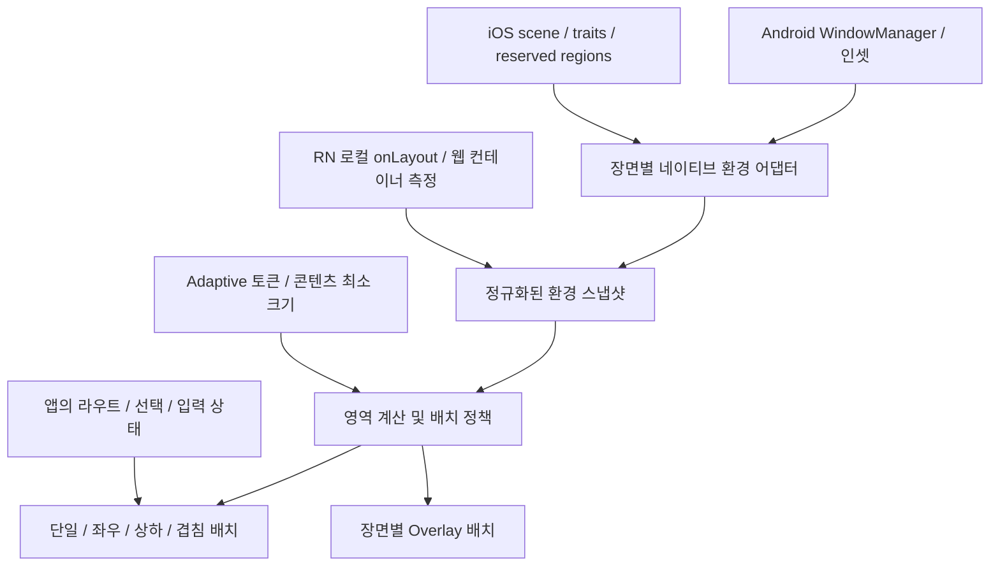

# ZS-UI 폴더블 공통 디자인 시스템 기획·설계

작성·수정일: 2026-09-12 KST · 상태: 개발 제안 / 구현 전 · 대상: Android 폴더블, iPhone Duo, 기존 모바일·태블릿·웹

## 1. 제안 결론

ZS-UI의 폴더블 지원을 **사용 가능한 영역에 따라 적응하는 디자인 시스템**으로 새로 만든다. 기기의 접힘 여부를 화면 분할 조건으로 사용하던 구조를 교체하고, 창·장면·컨테이너의 크기와 시스템이 보고한 분할·가림 영역을 함께 해석한다. Android와 iOS는 동일한 컴포넌트 계약을 사용하며 플랫폼 고유 내비게이션 동작은 각 플랫폼 어댑터가 담당한다.

이번 산출물은 기획과 실행 계획이다. 아래의 신규 API·경로·수치·일정은 **ZS-UI 설계 제안**이며 현재 배포 API와 구분한다. 런타임 코드는 이 작업에서 수정하지 않는다.

| 문서 | 내용 |
| --- | --- |
| [기획·설계](./README.md) | 제품 범위, 공통 모델, 토큰, 컴포넌트 동작, API 교체 |
| [공식 자료 조사](./research.md) | Apple·Android·React Native·Expo 근거, 확인 수준, 현행 코드 분석 |
| [개발 실행 계획](./implementation-plan.md) | 작업 순서, 담당 역할, SDK 의존성, 테스트, 릴리스 기준 |

**현재 전제:** iPhone Duo는 Apple이 2026-09-09 발표했으며 판매는 10월 23일 예정이다. 9월 12일 개발자 허브는 Xcode 27.1 베타와 상세 준비 문서를 이달 말 공개 예정으로 안내한다. 공식 세션에 소개된 iOS 27.1 API는 SDK 공개 후 시그니처·가용성·RN 연동을 검증한다. [공식 발표](https://www.apple.com/newsroom/2026/09/apple-unveils-iphone-duo/), [개발자 허브](https://developer.apple.com/iphone-duo/)

## 2. 해결할 사용자 문제와 목표

| 사용자 상황 | 제공할 경험 | 성공 조건 |
| --- | --- | --- |
| 목록에서 상세를 읽다가 펼침 | 공간이 충분하면 목록과 선택한 상세를 함께 표시 | 선택 항목·뒤로가기 경로 유지 |
| 폼 작성·메뉴 선택 중 접힘 | 입력과 열린 작업을 새 가용 영역으로 이동 | 텍스트·커서·메뉴 작업 유지 |
| 책처럼 반쯤 접어 읽음 | 중요한 고정 컨트롤과 모달을 접힘 영역에서 이동 | 버튼·모달의 힌지/카메라 충돌 0건 |
| 테이블에 세워 사용 | 미디어/미리보기와 조작 영역을 상하로 배치 | 허용한 화면에서만 상하 전환 |
| 분할 화면·작은 창에서 사용 | 창 크기에 맞는 단일 패널과 접근 가능한 탐색 제공 | 모든 주요 기능에 계속 접근 |
| 큰 글자·스크린리더·외부 키보드 사용 | 읽기 순서, 포커스, 동작 의미 유지 | 숨겨진 패널의 중복 접근성 노출 0건 |

폴더블의 성공을 단순한 화면 꽉 채우기나 2열 표시로 판단하지 않는다. 핵심 과업 완료, 가림 회피, 전환 중 연속성, 일관된 API를 제품 성과로 삼는다. 정량 검증은 실행 계획의 수용 기준을 따른다.

## 3. 범위와 책임

| 구분 | 1차 공통 지원 | 후속 확장 |
| --- | --- | --- |
| 환경 | 창 크기·로컬 크기·인셋·영역·글자 배율·방향성·수집 상태 | 선택적 힌지 각도, 입력 장치 특성 |
| 레이아웃 | 단일, 목록/상세, 보조 패널, 명시적 tabletop | 3개 이상 패널, 사용자 패널 비율 조절 |
| UI | 컨테이너, 그리드, 툴바 계약, 주요 오버레이, 폼·달력 | 고급 드래그 앤 드롭, 스타일러스 특화 |
| 장면 | 각 RN root/scene별 상태 격리 | 앱의 새 창 생성·복수 디스플레이 동시 UI |
| 플랫폼 | Android 실제 fold 정보, iOS 일반 adaptive + Duo 영역 어댑터, 웹 크기 대응 | 웹 posture API, 카메라 accessory |

ZS-UI는 공간 계산·배치·접근성·오버레이 호스트를 소유한다. 앱은 라우트, 선택된 데이터, 입력 초안, 네트워크 요청, 영속화, 카메라 세션, 새 장면 생성을 소유한다. 라이브러리가 화면을 나누는 순간 데이터 요청이나 탐색 이력을 새로 만들 필요가 없도록 한다.

**지원 등급:** `adaptive`는 크기/안전 영역 대응, `region-aware`는 실제 네이티브 분할·가림 영역 대응, `validated`는 지정한 기기·OS·빌드의 수용 테스트 통과를 뜻한다. iOS 공통 엔진이나 시뮬레이션만 통과한 상태는 iPhone Duo 실기기 지원 완료와 구분한다.

## 4. 제로 베이스 원칙

1. 배치 판단의 기준을 **현재 컨테이너의 실측 가용 공간**으로 둔다. 모델명·화면 인치·기기 종류는 QA 목록에서 사용한다.
2. 크기, 영역, capability, 작업 상태를 서로 다른 입력으로 둔다. 넓은 일반 태블릿도 2패널이 가능하고, 펼친 폴더블의 작은 창은 단일 패널일 수 있다.
3. 분할 영역과 가림 영역을 별도 의미로 유지한다. 폭 0인 분할선도 두 공간을 구분할 수 있다.
4. 각 scene/RN root는 독립적인 환경·overlay store를 갖는다. 내부·외부 화면 전환과 두 창을 각각 처리한다.
5. 배치 변경 시 콘텐츠의 정체성과 과업 상태를 유지한다. 이동·크기 변경의 양은 필요한 수준으로 제한한다.
6. 미수집·미지원·오류를 명시한다. 해당 상태에서는 현재 창과 안전 영역을 이용한 기본 레이아웃을 제공한다.
7. 기존 폴더블 알고리즘을 신규 엔진의 내부 경로로 사용하지 않는다. 색·글꼴·아이콘 등 독립적인 브랜드 자산은 유지한다.

## 5. 구조



추천 방식은 **얇은 플랫폼 수집 계층 + 공통 TypeScript 계산 엔진 + RN 컴포넌트**이다. UIKit/Compose 전체 UI를 각각 구현하는 방식보다 ZS-UI의 사용 계약과 검증을 공유하기 쉽다. Apple 표준 내비게이션 연동은 별도 연결 계층으로 검증한다. `ArrangementView`/`UIArrangementViewController`를 RN children 호스트로 직접 쓰는 방안은 1차 필수 경로에서 분리하고 기술 실험 대상으로 둔다.

제안 모듈은 `src/adaptive/{types,geometry,policy,store}`, `src/context/AdaptiveContext.tsx`, `src/ui/ZSAdaptiveLayout`, `src/ui/ZSAdaptiveGrid`, `src/overlay/placement`, 플랫폼별 `AdaptiveEnvironmentObserver`로 나눈다. 실제 파일명과 공개 export는 0단계 계약 검토에서 확정한다.

## 6. 공통 환경 계약

아래는 설계용 타입 초안이다. native API의 실제 선언을 옮긴 코드가 아니다.

```ts
type Rect = { x: number; y: number; width: number; height: number };
type Insets = { top: number; right: number; bottom: number; left: number };
type Support = 'supported' | 'unsupported' | 'unknown';
type DataStatus = 'pending' | 'ready' | 'degraded';

type LayoutRegion = {
  id: string;
  kind: 'division' | 'occlusion';
  bounds: Rect;
  active: boolean;
  axis?: 'horizontal' | 'vertical'; // 영역/접힘선 자체의 방향
  source: 'android-window-manager' | 'ios-reserved-region';
};

type AdaptiveEnvironment = {
  sceneId: string;
  surfaceId: string;
  generation: number; // 재부착·장면 전환 시 증가
  revision: number; // 같은 generation 안에서 단조 증가
  status: DataStatus;
  windowBounds: Rect;
  containerBounds: Rect;
  safeAreaInsets: Insets;
  regions: readonly LayoutRegion[];
  fontScale: number;
  layoutDirection: 'ltr' | 'rtl';
  platformTraits?: {
    horizontalSizeClass?: 'compact' | 'regular' | 'unspecified';
    verticalSizeClass?: 'compact' | 'regular' | 'unspecified';
  };
  capabilities: { division: Support; occlusion: Support };
};
```

좌표 계약은 다음과 같다.

| 항목 | 정의 |
| --- | --- |
| 단위 | JS에서는 RN 논리 단위. Android px는 현재 density로 환산하고 iOS는 pt를 사용한다. 웹은 CSS px 대응 |
| 기준 좌표 | 정규화 결과의 모든 rect는 현재 adaptive surface의 로컬 좌표. `containerBounds`는 보통 `(0,0,w,h)`, `windowBounds`는 같은 원점으로 변환한 창 rect |
| 방향 | x/y 및 left/right는 물리 좌표. 콘텐츠의 leading/trailing은 `layoutDirection`으로 별도 해석 |
| 인셋 | 해당 surface에 실제 남는 인셋. 이미 적용한 바/부모 인셋은 중복 차감하지 않는다 |
| 영역 | 원본 source와 active를 유지한다. 하나의 물리 feature가 분할과 가림을 모두 만들면 두 의미를 연결 가능한 id로 보존 |
| 값 검증 | 유한 수, 음수가 아닌 크기, 현재 surface 교차 여부 검증. 폭 또는 높이 0인 division은 별도 교차 판정 |
| 키보드 | 구조적 size class와 구분한 임시 obstruction. 플랫폼 resize로 이미 감소한 영역과 중복 차감하지 않도록 별도 프레임/적용 방식 기록 |

`regions: []`는 현재 창에 관측된 영역이 없다는 뜻이다. 기기가 접혔는지, 평면인지, 센서가 없는지는 이 값만으로 판단하지 않는다. `status`, capability, 필요 시 별도 diagnostic 정보를 함께 확인한다.

### 플랫폼 매핑

| 관측값 | 공통 변환 | 처리 원칙 |
| --- | --- | --- |
| Android `isSeparating=true` | active division | 실제 bounds를 사용해 공간 분리 |
| Android `occlusionType=FULL` | active occlusion | 보이지 않는 영역을 인터랙션/콘텐츠 배치에서 제외 |
| Android `FLAT`, non-separating | 진단용 feature, active 분할 없음 | 가용 폭으로 일반 adaptive 판단 |
| Android `HALF_OPENED` + horizontal/vertical | 상하/좌우 분할 후보 | orientation은 hinge 방향이며 콘텐츠 축과 구별 |
| iOS `.division` / `.occlusion` | 대응 kind로 보존 | 활성 영역을 배치에 사용; 비활성 영역은 선택적 그리드 힌트 |
| iOS compact/regular | `platformTraits` | 공통 폭 클래스와 별도 보존 |
| 미지원·로딩·실패 | capability/status에 반영 | 측정된 컨테이너에서 기본 배치 |

Android 속성은 [FoldingFeature](https://developer.android.com/reference/androidx/window/layout/FoldingFeature), iOS 영역은 [공식 adaptive 세션](https://developer.apple.com/videos/play/tech-talks/111463/)을 근거로 한다. 매핑 규칙은 ZS-UI 제안이다. 힌지 각도는 공통 레이아웃의 필수 입력으로 두지 않는다.

### 수명주기와 갱신

surface가 네이티브 window에 부착되면 구독과 초기 스냅샷을 연결하고, 부착 해제·scene 종료 시 해제한다. 전역 Expo 이벤트 리스너 수와 개별 surface의 수명은 별도로 관리한다. 포그라운드 복귀·Activity 교체·density/traits 변경 때 다시 측정한다.

같은 generation의 최신 revision만 채택한다. 초기 비동기 조회가 늦게 끝나도 더 최신 이벤트를 덮어쓰지 않는다. region·bounds·인셋의 일관된 묶음을 전달하고, RN `onLayout`과 native geometry의 세대가 다르면 일치할 때 재계산한다. 동일 스냅샷에서는 구독자를 갱신하지 않는다.

공통 store는 surface별로 구성하고 selector 단위로 구독한다. 키보드 이벤트와 무관한 텍스트/색상 컴포넌트까지 갱신하지 않도록 theme context와 환경 context를 분리한다. 웹 SSR은 명시된 초기 크기 또는 보수적인 단일 패널로 렌더링하고 hydration 후 실제 측정으로 갱신한다.

## 7. 크기와 토큰 정책

Android의 공식 폭 기준은 `<600`, `600–839`, `840–1199`, `1200–1599`, `1600 이상` dp이고, 높이 기준은 `<480`, `480–899`, `900 이상` dp이다. 이를 **ZS-UI 기본 후보**로 채택하되 iOS의 compact/regular와 동치로 간주하지 않는다. OS window 클래스와 padding을 제외한 콘텐츠 가용 폭도 별개로 저장한다. [Android window size classes](https://developer.android.com/develop/ui/compose/layouts/adaptive/use-window-size-classes)

| 제안 토큰 | 초기값 | 용도 |
| --- | --- | --- |
| `adaptive.breakpoints.width` | 600 / 840 / 1200 / 1600 | 앱 shell 수준의 크기 분류 |
| `adaptive.breakpoints.height` | 480 / 900 | 낮은 창과 세로 공간 분류 |
| `adaptive.margin` | compact 16, medium 24, expanded 이상 32 | 안전 영역 내부의 콘텐츠 여백 |
| `adaptive.gutter` | 16 / 24 | 일반 패널·그리드 간격 |
| `adaptive.contentMaxWidth` | form 560, reading 720 | 단일 콘텐츠 가독성 상한 |
| `adaptive.paneMinWidth` | primary 280, secondary 320 | 두 콘텐츠가 실제 수용 가능한 폭 |
| `adaptive.paneMinHeight` | preview 180, controls 160 | tabletop 콘텐츠 최소 높이 |
| `adaptive.regionClearance` | 8 | 시스템 region 외곽의 추가 조작 여유 후보 |
| `adaptive.overlayMaxWidth` | alert 360, sheet 560, menu 320 | 최종 가용 영역으로 다시 clamp |
| `adaptive.minimumTargetSize` | 48 논리 단위 | ZS-UI 공통 터치 목표; 작은 pane에서도 유지 |
| `adaptive.motion` | 기본 160ms, reduced motion 0ms | 물리 영역 변경 안정화 후 선택적 이동 |

위 수치는 ZS-UI의 시작 가설이다. 폰트가 커지면 컨트롤 높이·줄바꿈을 먼저 늘리고 공간이 부족하면 패널 수를 줄인다. 글자를 화면 폭 비율로 축소해 맞추는 방식은 교체 대상이다. Figma와 실제 기기 검증으로 값을 조정하고 토큰 버전을 기록한다.

### 배치 결정 우선순위

1. 로컬 surface와 유효 인셋으로 안전한 콘텐츠 공간을 얻는다.
2. active occlusion은 가림 회피로, active division은 분할선으로 처리한다. 영역이 겹치면 합집합으로 계산해 중복 차감을 방지한다.
3. 실제 divider가 공간을 양분하면 그 경계를 사용한다. 단순히 `width / 2`로 나누지 않는다. 낮은 품질/복합 topology는 가장 큰 유효 영역 하나에 활성 패널을 표시한다.
4. 분할된 각 영역에 콘텐츠 최소 크기가 맞고 해당 패턴이 축을 허용하면 좌우/상하 배치를 선택한다. 힌지가 있어도 두 과업을 수용할 수 없으면 한 영역에 활성 과업과 대체 탐색을 제공한다.
5. 분할선이 없으면 패널 최소 폭의 합, gutter, 내비게이션 점유 영역으로 두 패널 적합성을 판단한다. `medium`에서도 실제 공간이 맞으면 가능하다.
6. 키보드가 나타나면 구조적 패널 선택을 우선 유지하고 활성 pane의 viewport·스크롤·overlay를 조정한다. 실제 입력 영역을 확보할 수 없을 때 단일 과업 배치로 전환한다.
7. 창 축소 시 최소 크기 미달을 즉시 처리한다. 경계 떨림은 확대 진입에만 작은 여유값을 두거나 안정된 geometry 묶음으로 해결하며 실제 가림 변화는 즉시 반영한다.

연속 피드·긴 문서에는 임의의 칼럼 재배치를 기본 적용하지 않는다. 일반 시각적 접힘에서는 읽기 흐름을 유지하고 고정 컨트롤을 이동한다. 실제 `FULL` 가림이 있는 듀얼 스크린에서는 본문도 한 유효 영역에 맞추거나 페이지 단위 패턴을 명시적으로 선택한다.

## 8. 컴포넌트 구성과 동작

| 컴포넌트/계약 | 단일·작은 영역 | 넓고 연속된 영역 | 활성 분할·가림 영역 |
| --- | --- | --- | --- |
| `ZSContainer` | safe area, 스크롤, 키보드 책임 | form/reading max-width 적용 | 할당받은 pane 안에서 동작 |
| 신규 `ZSAdaptiveLayout` | 선택한 primary 또는 secondary | list-detail/supporting을 수용 폭으로 배치 | 실제 분할 경계, 축 허용, 최소 크기로 결정 |
| 신규 `ZSAdaptiveGrid` | 카드 최소 폭으로 열 계산 | 열 수와 밀도 증가 | 각 영역에 완전한 카드 배치; 짝수 열은 힌트 |
| 툴바/탐색 연결 계약 | 핵심 탐색과 overflow 접근 | Android rail/sidebar 정책, iOS 시스템 bar 연동 | 각 pane의 과업 제어 위치 유지 |
| Alert | 가용 영역 내 가운데 | max-width 유지 | source pane 우선, iOS 책 자세의 기본 fallback은 trailing 후보 |
| BottomSheet / Modality | 내용 스크롤과 접근 가능한 닫기 | 바닥/중앙 presentation 정책 | 한 유효 영역으로 이동; ID·초안·열림 유지 |
| PopOver / Dropdown / Tooltip | anchor와 연결 | 내용 크기대로 표시 | 같은 좌표의 anchor 기준 flip/shift/clamp |
| Snackbar / Loader | 과업을 수행한 pane 기준 | 필요 시 scene 범위 명시 | 메시지·로딩은 정해진 scope에서 단일 인스턴스 |
| TextField / 선택 컨트롤 | 글자 확대·줄바꿈·터치 크기 유지 | 폭만 정책에 따라 확대 | 포커스와 입력 selection 유지 |
| Calendar / Skia | 실제 할당 폭으로 셀과 터치 계산 | 콘텐츠 상한 유지 | 월 그리드는 기본 한 pane, 필요 시 상세를 보조 pane |

`ZSContainer`에서 탐색 계층·패널 분할을 분리해 `ZSAdaptiveLayout`이 담당하게 한다. `ZSTab`은 현재 API/용도를 유지할 수 있는 범위를 확인하고, 곧바로 앱 router나 iOS native tab bar와 같은 것으로 취급하지 않는다.

### iPhone Duo의 시스템 UI 연결

Apple은 내비게이션 컨테이너가 제공하는 bar를 최신 SDK로 빌드할 때 측면 배치를 적용하는 방식을 설명한다. RN의 임의 `View`, `ZSTab`, 커스텀 헤더가 자동으로 이동하는지는 별도 문제다. `react-native-screens`·Expo Router의 설치 버전으로 native-stack/탭/toolbar 최소 앱을 빌드해 확인하고, 미지원이면 해당 연결 계층의 호환 업데이트 또는 작은 native host를 검토한다. [Raise the bar](https://developer.apple.com/videos/play/tech-talks/111462/)

공통 툴바 계약은 `id`, `label`, `icon`, `priority`, `group`, `onPress`, `disabled`를 전달하고 실제 표현·overflow를 platform adapter가 정한다. Apple bar의 물리적 측면은 시스템의 결정값을 따른다. 일반 콘텐츠의 RTL leading/trailing 처리와 하드웨어에 맞춰진 bar 측면을 분리한다. Split View에서 반대쪽 edge에 bar가 배치되는 경우도 시험한다. [Duo HIG](https://developer.apple.com/design/human-interface-guidelines/designing-for-iphone-duo)

### Overlay 공통 정책

새 overlay 요청은 `sceneId`, `sourcePaneId`, 선택적 `anchor`, `scope: 'pane' | 'scene'`, `presentation: 'auto' | 'bottom' | 'center' | 'anchored'`를 갖는다. 요청 당시 크기 대신 현재 surface geometry로 열린 뒤에도 재배치한다.

위치 선택은 **호출한 pane → 유효 anchor가 포함된 영역 → 현재 활성 과업 영역 → 플랫폼 기본 후보 → 가장 큰 유효 영역** 순서다. 후보마다 콘텐츠 최소 크기, occlusion, IME 교차를 평가한다. 꽉 차는 경우 내부 스크롤을 제공하고 닫기/확정 동작을 보이는 위치에 유지한다. anchor가 사라지면 popover는 안전한 닫기 정책을 적용하고 편집 중 sheet는 활성 과업 영역에서 계속 제공한다.

backdrop의 입력 차단 범위는 scope를 따른다. pane modal은 다른 pane과의 상호작용을 허용하고 scene modal은 전체 해당 scene을 차단한다. VoiceOver/TalkBack 포커스 트랩·복귀, escape/뒤로가기, 중첩 portal 우선순위도 같은 범위를 따른다. RN `Modal`로 별도 native window가 생기면 새 surface에서 다시 측정한다.

## 9. 상태 연속성과 접근성

패널의 영구 ID와 앱 상태를 화면 표현에서 분리한다. 목록 선택·폼 값·초안·미디어 재생 위치는 layout 바깥의 앱 상태에 둔다. 스크롤은 픽셀만이 아니라 항목 ID와 상대 offset을 함께 저장하고 재배치 후 복원한다. 넓은 화면에서 상세를 보다가 접으면 해당 상세를 유지하며, 뒤로가기는 동일한 목록 선택 위치로 돌아간다.

React에서는 동일한 `key`만으로 다른 부모로 이동한 subtree의 상태가 보장되지 않는다. 가능한 배치는 같은 호스트/트리 위치에서 style로 바꾸고, 구조 이동이 필요한 경우 제어 가능한 앱 상태와 scroll/focus 복원 계약을 사용한다. `TextInput`을 양쪽에 복제해 숨기는 접근은 IME·접근성·부작용 문제를 만들 수 있으므로 활성 과업 인스턴스를 단일하게 관리한다. [React state 보존](https://react.dev/learn/preserving-and-resetting-state)

접근성 기준은 글자 배율 1.0/1.3/2.0과 OS 최대 접근성 글꼴, 한국어/긴 번역/RTL, VoiceOver/TalkBack, 외부 키보드 Tab·Shift-Tab·Enter·Escape를 포함한다. 숨겨진 pane은 접근성 트리와 focus 순서에서 제외하고, pane 수 변경 후 현재 과업의 이름·제목으로 포커스를 복귀한다. reduced motion은 기하 배치를 즉시 갱신한다.

## 10. 신규 사용 계약 예시

다음은 구현 이후 목표 사용법을 설명하는 의사 API이다. 현재 패키지에 복사해 실행하는 예제가 아니다.

```tsx
<SafeAreaProvider>
  <ThemeProvider>
    <ZSAdaptiveProvider>
      <OverlayProvider>
        <AppNavigator />
      </OverlayProvider>
    </ZSAdaptiveProvider>
  </ThemeProvider>
</SafeAreaProvider>
```

`ZSAdaptiveProvider`는 실제 측정 surface를 소유한다. navigation/Modal이 새로운 native root를 만들면 그 root에 별도 provider/overlay 연결을 둔다. 화면 내부 `ZSAdaptiveLayout`은 자신의 크기를 측정하고 상위 region을 해당 좌표로 투영한다.

```tsx
<ZSAdaptiveLayout
  pattern="list-detail"
  preferredAxes={['horizontal']}
  activePane={selectedId ? 'detail' : 'list'}
  onActivePaneChange={handlePaneNavigation}
  panes={[
    { id: 'list', minWidth: 280, content: <ItemList /> },
    { id: 'detail', minWidth: 320, content: <ItemDetail /> },
  ]}
/>
```

일반 소비자는 pattern·최소 크기·과업만 지정한다. 세부 구성은 `useAdaptiveEnvironment()`와 `usePaneLayout()`을 이용하되 platform별 원시 sensor 값을 일반 화면 props로 전파하지 않는다. `activePane` 변경은 앱의 실제 탐색 상태와 일치시킨다.

## 11. 기존 API 교체와 버전 정책

기존 지원의 구현과 공개 API를 새 엔진에 맞춰 정리하는 **다음 major 릴리스**를 제안한다. 정확한 버전은 현행 릴리스 작업과 합의하며, 이번 문서 작업은 `package.json`을 바꾸지 않는다. 안정판 사용자는 기존 major에 고정하고 신규 major의 prerelease로 이관한다.

| 교체 대상 | 새 계약 | 이관 시 확인 |
| --- | --- | --- |
| `useFoldingState`, `FoldingState` | 환경 훅 + 최종 pane layout | folded/unfolded 문자열 비교를 실제 공간/패턴 선택으로 변경 |
| `getFoldingFeature` snapshot | surface별 이벤트 + 초기 geometry | 화면 크기 변화 없이 발생하는 fold 갱신 |
| `ZSContainer.rightComponent` | 의미 있는 ID의 secondary pane | 좁은 화면에서 secondary 접근 경로 |
| `dividerLineComponent` | adaptive divider / region gap | 실제 hinge gap과 장식 divider 구분 |
| `foldableSingleScreen` | single 패턴 또는 overlay presentation | 콘텐츠 상한·위치·scope를 독립 지정 |
| `unfoldedSinglePaneMaxWidth` | 콘텐츠 역할별 max-width | 일반 태블릿·큰 창에서도 동일 정책 |
| `ThemeProvider.foldable` | 정적 adaptive 토큰 + 별도 환경 provider | 기존 theme 소비자의 갱신·타입 영향 |
| 전역 overlay 단일 대상 | scene별 host와 명시적 target | 두 scene의 잘못된 alert/loader 공유 |

구형 folded/unfolded를 신규 환경에서 추정해 계속 제공하는 장기 호환층은 채택하지 않는다. 전환 안내 표·개발 경고·검색 스크립트/필요한 codemod는 이관 도구로 제공할 수 있다. 기존 branch/release는 rollback 수단으로 유지한다.

기존 Android 플러그인이 지정한 `launchMode=singleTask`와 `configChanges` 전체 주입도 재설계 범위다. 앱의 deep link·task 정책은 앱이 소유하고 라이브러리는 필요한 관측/설정만 명시한다. Activity 재생성이 발생하는 경로까지 상태 복원을 검증한다.

## 12. 개발 착수 조건

기본 결정은 공통 영역 모델, 장면 격리, major 교체, Android stable WindowManager, iOS 기능 감지·가용성 분기이다. [실행 계획](./implementation-plan.md)의 첫 단계에서 최소 재현 앱과 데이터 fixture로 계약을 검증한다. SDK가 준비되기 전에도 geometry/토큰/Android/웹/상태 복원 작업을 진행하며, iPhone Duo 지원 등급은 실제 SDK·시뮬레이터·기기 결과에 맞춰 올린다.
